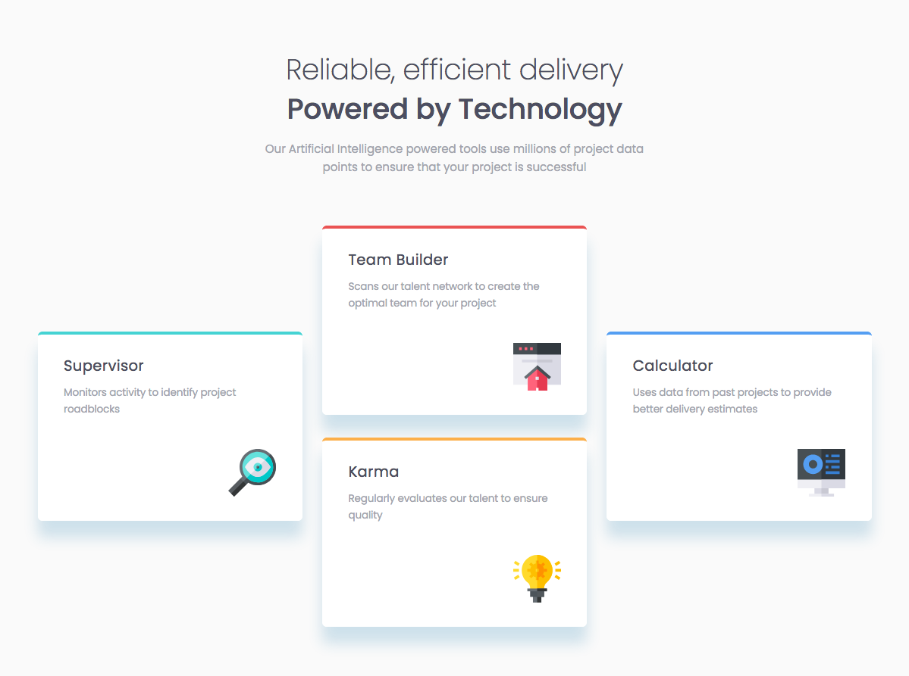
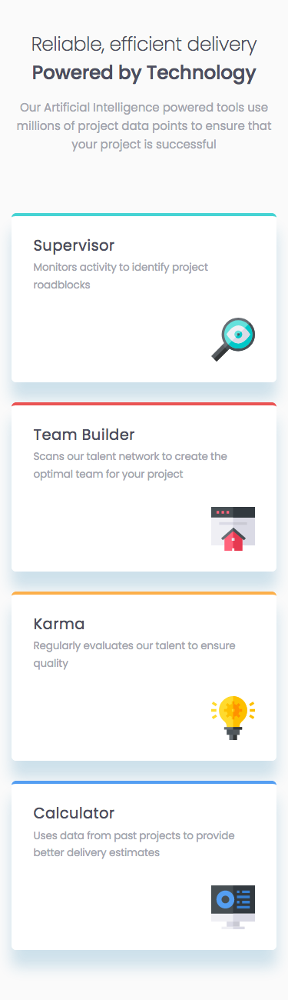

# Frontend Mentor - Four card feature section solution

This is a solution to the [Four card feature section challenge on Frontend Mentor](https://www.frontendmentor.io/challenges/four-card-feature-section-weK1eFYK). Frontend Mentor challenges help you improve your coding skills by building realistic projects.

## Overview

### The challenge

Users should be able to:

- View the optimal layout for the site depending on their device's screen size

### Screenshot




### Links

- [Solution](https://www.frontendmentor.io/solutions/four-card-feature-section-with-css-grid-and-flexbox-FR2nQzCdh)
- [Live Site](https://filippo-b.github.io/four-card-feature/)

## My process

### Built with

- Semantic HTML5 markup
- Flexbox
- CSS Grid
- Mobile-first workflow
- SCSS

### What I learned

You can match all the elements with a class that starts with a specific set of characters. For example, something like

```
    article[class*="card"] {
      margin-bottom: 0;
      padding: 2rem 2.3rem 2.1rem;
    }
```

will match only the articles with a class that starts with “card”.

### Useful resources

- [Match all elements having class name starting with a specific string](https://stackoverflow.com/questions/13352080/match-all-elements-having-class-name-starting-with-a-specific-string)
- [Creating a nice layout CSS Grid layout using grid template areas](https://youtu.be/v5KzBPUEgGQ).

## Author

- Frontend Mentor - [@Filippo-B](https://www.frontendmentor.io/profile/Filippo-B)
